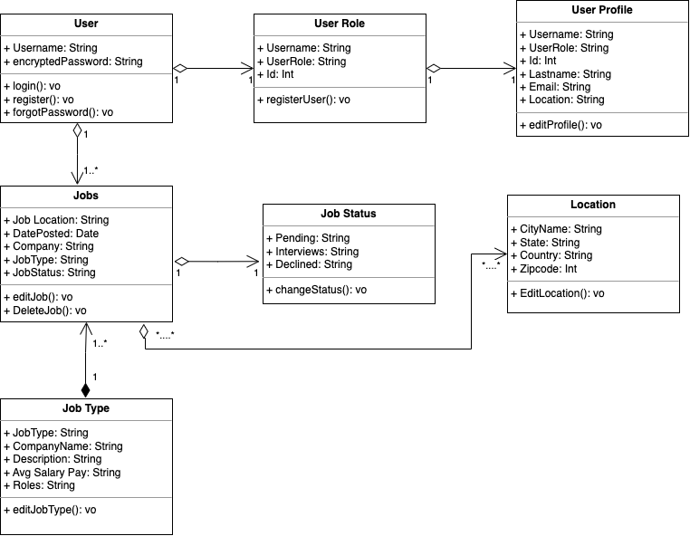

# Jobnest


## Overview

Jobnest is a dynamic job tracking platform designed to increase user engagement and operational efficiency through real-time analytics, advanced search and filtering options, and engaging UI elements. Built using the MERN stack (MongoDB, Express, React, Node), Jobnest offers secure user data handling with OAuth and JWT, and a user-friendly interface that boosts retention and daily active users.

## Table of Contents
- [Features](#features)
- [Installation](#installation)
- [Usage](#usage)
- [Technologies Used](#technologies-used)
- [Screenshots](#screenshots)
- [Team Members](#team-members)
- [Milestones and User Stories](#milestones-and-user-stories)
- [Object Model](#object-model)
- [REST API Resources](#rest-api-resources)
- [Contributing](#contributing)
- [License](#license)
- [Contact](#contact)

## Features
- **Real-Time Analytics**: Provides users with up-to-date insights on job applications.
- **Advanced Search and Filtering**: Enables users to find relevant job opportunities efficiently.
- **Secure Data Handling**: Uses OAuth and JWT for secure authentication and authorization.
- **Engaging UI Elements**: Includes animations and progress trackers to enhance user experience.
- **Increased User Retention**: Improved interactivity leads to a 25% increase in user retention and a 30% uplift in daily active users.

## Installation
To set up Jobnest on your local machine, follow these steps:

1. **Clone the repository**:
   ```bash
   git clone https://github.com/VatsalDoshi/JobNest.git
   cd JobNest
   ```

2. **Backend Setup**:
   ```bash
   cd backend
   npm install
   npm start
   ```

3. **Frontend Setup**:
   ```bash
   cd frontend-jobnest/jobnest
   npm install
   npm install @babel/helper-skip-transparent-expression-wrappers
   npm start
   ```

## Usage
1. **User Registration and Login**:
   - Students and recruiters can register and log in to the platform.
   - OAuth and JWT ensure secure authentication and authorization.

2. **Job Posting and Tracking**:
   - Students can post jobs they have applied for and track their status.
   - Recruiters can post job openings for students to apply.

3. **Analytics and Reporting**:
   - Provides visual reports in bar and area chart formats.
   - Users can track application status and performance metrics.

## Technologies Used
- **Frontend**: React, Redux, Material-UI
- **Backend**: Node.js, Express.js
- **Database**: MongoDB
- **Authentication**: OAuth, JWT
- **Hosting**: AWS S3
- **Other Tools**: Webpack, Babel, ESLint, Prettier

## Screenshots


## Team Members
- Sneha Giranje: NUID 002785370 | giranje.s@northeastern.edu
- Aditi Jajoo: NUID 002725479 | jajoo.a@northeastern.edu
- Kinjal Bhatia: NUID 002776038 | bhatia.kin@northeastern.edu
- Vatsal Doshi: NUID 002776613 | doshi.va@northeastern.edu

## Milestones and User Stories
### Milestone 1: Landing Page (User login and registration)
- **User Stories**:
  - Students can create an account.
  - Students can log in to track their jobs.

### Milestone 2: Job Posting
- **User Stories**:
  - Students can add jobs they applied for using a form.
  - Students can view all applied jobs.

### Milestone 3: Job Tracking
- **User Stories**:
  - Students can view job applications and track their status.
  - Students can update application status and add notes.

### Milestone 4: Analytics and Reporting
- **User Stories**:
  - Students can view analytics and reports on job search activity.
  - Students can track applications in various locations.

## Object Model


## REST API Resources
### Login Page Resources
- **User Resource**: Stores user credentials and information.
- **Authentication Resource**: Validates user credentials and manages authentication tokens.
- **Session Resource**: Manages user sessions.
- **Error Resource**: Handles login errors and returns appropriate messages.

### Registration Page Resources
- **User Resource**: Creates new user accounts.
- **Authentication Resource**: Authenticates users during registration.
- **Profile Resource**: Updates user profile information post-registration.

### Job Tracking Resources
- **Application Resource**: Tracks job applications and their statuses.
- **Analytics Resource**: Generates reports on job search activity.

## Contributing
Contributions are welcome! Please follow these steps to contribute:

1. Fork the repository.
2. Create a new branch (`git checkout -b feature-branch`).
3. Commit your changes (`git commit -am 'Add new feature'`).
4. Push to the branch (`git push origin feature-branch`).
5. Create a new Pull Request.

## License
This project is licensed under the MIT License. See the [LICENSE](LICENSE) file for details.

## Contact
For any questions or feedback, please reach out to:

- **Name**: Vatsal Vaibhav Doshi
- **Email**: doshi.va@northeastern.edu
- **Portfolio**: [vatsal-doshi.com](https://vatsal-doshi.com/)
